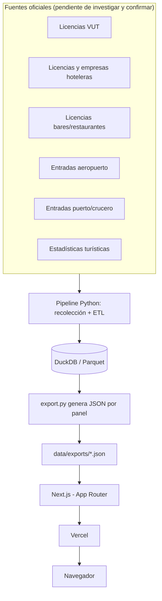

# Arquitectura técnica

Documento vivo. Actualizar cada vez que cambie el stack, la estructura de carpetas o cualquier
decisión técnica relevante. Los cambios deben registrarse también en `changelog/`.

---

## Stack seleccionado

| Capa | Tecnología | Justificación |
|------|-----------|---------------|
| Framework (frontend) | Next.js (App Router) | Control total sobre el design-system ya definido (paleta, mapas, dark mode, tooltips a medida); despliegue nativo en Vercel; buen SEO/SSG para un sitio público pensado para citarse. |
| Pipeline de datos | Python (pandas + DuckDB) | Ecosistema estándar para scraping/ETL; DuckDB permite cruzar datasets grandes (licencias, llegadas, estadísticas) sin levantar un servidor de base de datos. |
| Base de datos (producción) | Ninguna | El sitio es estático: sin tiempo real ni escritura de usuarios (ver WON'T en `prd.md`). DuckDB/Parquet son solo el almacén intermedio del pipeline, no se despliegan. |
| Autenticación | Ninguna | Acceso público sin cuentas ni login (ver `prd.md`). |
| Estilos | Tailwind CSS + tokens en CSS custom properties | Encaja con la escala 4px y los tokens de color light/dark de `design-system.md`. |
| Gráficos y mapa | SVG a medida (d3-geo solo para la proyección del mapa) | El método de la skill `dataviz` pide control fino de marcas/hover/accesibilidad — mejor construir los componentes a medida que adoptar una librería de charts completa. |
| Despliegue | Vercel | Conectado al repo de GitHub; build automático en cada push a `main`, preview por PR. |

**Por qué no Streamlit:** se evaluó como alternativa Python de punta a punta, pero no despliega de
forma nativa en Vercel/Netlify (necesita un proceso persistente, no hosting estático/serverless) y
limita el control visual fino que pide `design-system.md`. Queda como opción de respaldo si el
desarrollo frontend en Next.js resultara un cuello de botella — decisión registrada abajo.

---

## Diagrama de componentes



El pipeline y el frontend solo se comunican a través de los JSON exportados — nunca en vivo. Esto
es deliberado: ver la decisión registrada más abajo.

---

## Estructura de carpetas

```
/
├── data/
│   ├── raw/              → descargas originales de cada fuente, sin transformar
│   ├── processed/        → Parquet limpio y cruzado (lo que consulta DuckDB)
│   └── exports/          → JSON generado para el frontend, uno por panel del dashboard
├── pipeline/             → scripts Python de recolección y ETL
│   ├── sources/          → un módulo por fuente (vut, hoteles, restauracion, aeropuerto, puerto, estadisticas)
│   ├── transform/        → limpieza, cruce entre fuentes, agregación por municipio/periodo
│   └── export.py         → genera data/exports/*.json a partir de data/processed/
├── web/                  → app Next.js
│   ├── app/               → rutas (App Router)
│   ├── components/        → FilterBar, ChoroplethMap, StatTile, TimeSeriesChart... (ver design-system.md)
│   ├── lib/                → tokens de color/tipografía, utilidades de formato
│   └── public/data/        → copia de data/exports consumida por el frontend
├── docs/                 → esta documentación
├── changelog/
└── mejoras/
```

---

## Estrategia de autenticación

Ninguna. El sitio es de acceso público y abierto — no hay cuentas, login ni roles (ver `prd.md`,
sección "Fuera de alcance"). Si esto cambiara más adelante, afecta a esta sección y activa
`docs/user-flows.md` con estados de sesión.

---

## Integraciones externas

No son integraciones de producto (no hay servicios de pago, email, etc.) sino **fuentes de datos
oficiales** que el pipeline consulta. Primera pasada de investigación hecha (2026-08-27); cada
fuente se valida de verdad (campos reales, cobertura real) al implementar `pipeline/sources/`, no
solo por el nombre del dataset.

| Categoría | Fuente | Cobertura | Formato | Notas |
|-----------|--------|-----------|---------|-------|
| Licencias VUT (ciudad) | [Open Data BCN — Habitatges d'ús turístic](https://opendata-ajuntament.barcelona.cat/data/ca/dataset/habitatges-us-turistic) — **verificado 2026-08-27** | Ciudad de Barcelona | CSV trimestral vía API CKAN (`package_show?id=habitatges-us-turistic`), 32 recursos hasta 2026 Q1, CC BY 4.0 | Columnas reales confirmadas: dirección completa + `LONGITUD_X`/`LATITUD_Y` (sin ofuscar) + `NUMERO_REGISTRE_GENERALITAT` (HUTB-XXXXXX, clave de cruce con [M-08]). **No trae nombre de empresa/titular** — ver aviso en `data-model.md` → `licencia_vut` |
| Licencias VUT/hoteles/turismo rural (Catalunya) | [Registre de Turisme de Catalunya](https://analisi.transparenciacatalunya.cat/Turisme/Establiments-d-allotjament-tur-stic-inscrits-al-Re/t2h3-cgys) (Generalitat) — **verificado 2026-08-27, descarga real probada** | **Toda Catalunya** (incluida Barcelona ciudad) | API Socrata (`analisi.transparenciacatalunya.cat/resource/t2h3-cgys.json`), consultable con SoQL (`$select`, `$where`, filtros por municipio/tipo) | **Resuelve el hueco de empresa/titular**: trae `cif` + `ra_social_del_titular` (o nombre/apellidos si es persona física), dirección completa, `total_places`. 112.714 registros activos: 104.561 VUT, 3.219 hoteles, 337 "apartaments turístics" (otra categoría), 2.810 turismo rural, etc. Barcelona ciudad: 10.650 VUT (cuadra con el "~10.000" citado habitualmente) — buena señal de fiabilidad. **Solo estado actual** (`estat=Alta` únicamente vía API), no serie histórica — para tendencia usar Idescat en paralelo. **Sin lat/lon** — haría falta geocodificar la dirección. Usa numeración propia (`ATB-XXXXXX` apartamentos, `HB-XXXXXX` hoteles), distinta del `HUTB-XXXXXX` de Barcelona ciudad — pendiente confirmar si son sistemas paralelos del mismo registro o corresponden 1:1 |
| Hoteles — serie histórica | [Idescat — Estadística d'establiments turístics](https://www.idescat.cat/pub/?id=turall) — **verificado 2026-08-28 con cifras reales** | Catalunya, con desglose por municipio (`?geo=mun:XXXXXX`) y comarca | Series anuales — comprobado: Barcelona ciudad tiene **83.454 plazas hoteleras en 2025**, serie completa **2003–2025** por categoría. Hay botón de descarga en la página; falta capturar la URL exacta del export estructurado | Complementa al registro en vivo: no da identidad de cada hotel, pero sí la evolución en el tiempo de establecimientos y plazas por municipio — lo que le falta al snapshot de Open Data BCN y al registro de la Generalitat |
| Hoteles (ciudad) | [Open Data BCN — Hotels a la ciutat de Barcelona](https://opendata-ajuntament.barcelona.cat/data/dataset/allotjaments-hotels) — **verificado 2026-08-27, corregido 2026-08-28** | Ciudad de Barcelona | 1 solo CSV + 1 JSON, sin serie trimestral (a diferencia de VUT) | **Corrección: el dataset SÍ está vivo.** La metadata CKAN del paquete dice `metadata_modified: 2023-10-31`, pero los registros de dentro llegan hasta **2026-08-19**: 118 de 446 filas modificadas en 2026. Lo que está obsoleto es la metadata, no los datos — no fiarse del campo del portal, mirar las fechas `created`/`modified` de las propias filas. Para altas recientes puede ir **por delante** del Registre de Turisme (ver el caso del ibis budget en `changelog/2026-08-28_18-51_*`) |
| Hoteles + bares/restaurantes (provincia, **excepto ciudad de Barcelona**) | [Diputació de Barcelona — Cens d'activitats i establiments](https://dadesobertes.diba.cat/datasets/cens-dactivitats-i-establiments) — **verificado 2026-08-28, filtro real resuelto** | +200 municipios de la provincia — **confirmado: Barcelona ciudad NO participa** (devuelve 0 registros), usa Open Data BCN en su lugar, no hace falta excluirla a mano | Filtro por municipio va **en la ruta, no en query string**: `do.diba.cat/api/dataset/establiments/camp-rel_municipi/<codi>/format/json` (probado con Santpedor: 323 registros correctos). El endpoint sin filtro devuelve siempre los mismos 1.000 primeros de 42.050, ignora cualquier query param | Trae **nombre comercial + NIF + razón social** + dirección + coordenadas. La actividad (`descripcio_activitat`) es texto libre ("BAR", "RESTAURANT", "BAR-RESTAURANT"...), no un código estable — clasificar por texto o por `codi_nace`, no por `id_ac` (no es consistente entre municipios) |
| Bares/restaurantes (ciudad) | [Open Data BCN — Cens d'activitats econòmiques](https://opendata-ajuntament.barcelona.cat/data/ca/dataset/cens-activitats-economiques-class-bcn) | Ciudad de Barcelona | CSV, ~61k actividades, filtrable por código de actividad | |
| Bares/restaurantes (fallback) | Google Places API | Global | 10.000 llamadas/mes gratis (nivel Essentials), de pago a partir de ahí | Solo si el open data no cubre algún municipio. No da licencias ni titular, solo qué figura en Google Maps — usar como complemento, no como fuente principal |
| Entradas de turistas (M-04) | **Decidido: OTB**, igual que M-05 — ver fila de abajo | Ciudad + región + total destino | Perfil del turista: volumen y origen | Se descartan AENA y Port de Barcelona como fuentes dedicadas (ver `roadmap.md` → Descartado): no respondieron al verificar, y OTB ya cubre volumen y origen sin necesitar sumar aeropuerto + puerto a mano. Si más adelante hace falta el desglose fino por vía de acceso (aérea/marítima/terrestre) que OTB no dé, Idescat/Frontur queda como opción de respaldo — API confirmada funcionando (`api.idescat.cat/emex/v1/dades.json`), falta el código de indicador |
| Gasto turístico | Idescat — Egatur / [Estadística de despesa turística](https://www.idescat.cat/estad/turdes) | Catalunya | Misma API, mismo pendiente: código de indicador | |
| Estadísticas turísticas generales (M-05) — **decidido: sustituye a Idescat/Egatur para esta categoría** | [Observatori del Turisme a Barcelona (OTB)](https://observatoriturisme.barcelona/) — organismo conjunto Ajuntament + Diputació + Turisme de Barcelona | **"Destinació Barcelona": ciudad, región y total destino, desagregados por separado** — coincide mejor con el alcance del proyecto que las cifras genéricas de Catalunya de Idescat | Varios tipos de informe: actividad turística (anual), seguimiento (mensual), **perfil del turista** (mensual y anual — volumen y origen, nacional/extranjero) | Lo que importa es qué dice (volumen + origen), no el formato en que venga — PDF o tabla se resuelve al implementar el pipeline, no bloquea la decisión de fuente. Verificado que existe con cifras reales (26,1 M visitantes y 14.041,7 M€ en 2025 para ciudad+región) |
| Estadísticas turísticas — **hallazgo adicional, complementa a OTB** | [LABturisme (Diputació de Barcelona) — "Interactiu anual"](https://lookerstudio.google.com/s/ughhKGmbLnc) — **verificado 2026-08-28, extracción real probada** | Provincia de Barcelona, filtrable por territorio (comarca, marca turística, "Entorn de Barcelona"...) y año | **Google Looker Studio — no Power BI**: el texto sí se puede extraer por automatización (Power BI de OTB es canvas puro, no se puede). Filtros interactivos (`TERRITORI`, `ANY`) — cambiar el filtro por click no funcionó en el primer intento (iframes anidados), pendiente reintentar o pedir acceso a los datos subyacentes a `labturisme@diba.cat` | Extraído real para "Entorn de Barcelona 2025": 5.364.515 viajeros, 15.817.613 pernoctaciones, oferta por tipo de alojamiento (HUTs, hoteles, càmpings...), valoraciones — ver `data/raw/otb/labturisme_interactiu_entorn_bcn_2025.txt`. Actualizado el mismo día de la consulta |
| Geometría municipal | [ICGC — WFS de divisions administratives](https://geoserveis.icgc.cat/servei/catalunya/divisions-administratives/wfs) — **verificado 2026-08-28, descarga real completa** | Catalunya completa (947 municipios) y provincia de Barcelona (311, filtrados) | WFS estándar OGC, `outputFormat=geojson` — GeoJSON real en WGS84, sin reproyectar. Capa: `divisions_administratives_municipis_5000` (escala 1:5.000, la más detallada) | 311 municipios en la provincia — coincide con la cifra oficial, buena señal. Trae `CODIMUNI`, `NOMMUNI`, comarca y provincia en las propiedades |
| Oferta anunciada en Airbnb | [Inside Airbnb](https://insideairbnb.com/) — **verificado 2026-08-27, descarga real probada** | Solo ciudad de Barcelona (confirmado: no publica el resto de municipios de la provincia por separado) | CSV directo en `data.insideairbnb.com/spain/catalonia/barcelona/<fecha>/visualisations/listings.csv` (+ `neighbourhoods.geojson`, útil como geometría de barrio). Snapshot verificado: 24/06/2026, 15.430 anuncios | **Hallazgo clave:** el campo `license` no es libre — Barcelona obliga a declarar el HUTB, y el **48% de los anuncios lo trae literal** (parseable con regex), lo que permite cruce **directo** por nº de licencia en vez de solo por dirección (ver `data-model.md` → `oferta_airbnb`, método `licencia_directa`). El resto no es automáticamente "sin licencia": una parte declara **exención** explícita (alquiler de temporada 31+ noches, hostel...), que se trata como categoría propia, no como candidato a sin licencia. Coordenadas ofuscadas ~200m por privacidad — el fallback por dirección sigue siendo una estimación, el match directo por licencia no. Ver referencia metodológica: [montera34/airbnb.barcelona](https://github.com/montera34/airbnb.barcelona) |
| Oferta anunciada en Booking | Ninguna — **descartado**, ver `roadmap.md` | — | — | **Sin fuente abierta equivalente a Inside Airbnb.** La API oficial de Booking es solo para afiliados/partners, no sirve para extracción masiva; su ToS prohíbe el scraping y aplica medidas anti-bot activas (tope de 1.000 resultados por búsqueda). Su inventario de hoteles ya lo cubre el registro oficial (M-02) |
| Construcción hotelera futura (para M-06) | Sin dataset único — **prensa especializada** (Hosteltur, idealista/news, Alimarket, EjePrime) para proyectos concretos anunciados | Variable, cobertura no sistemática | Artículos individuales, no datos estructurados | No sustituye a una fuente estructurada — es una lista que hay que mantener a mano. El dato realmente estructural es el **PEUAT** (ver más abajo): en 3 de las 4 zonas en las que divide la ciudad ya no se conceden licencias hoteleras nuevas, así que el límite legal de crecimiento importa más que la lista de proyectos anunciados |

**Alcance legal — más complejo de lo que asumía el PRD inicial:** hay dos capas normativas
distintas, no una sola "ley":

1. **Decret Llei 3/2023** (Generalitat, 7 nov. 2023) — regula el régimen urbanístico de las VUT en
   **262 municipios de toda Catalunya** (no solo la provincia de Barcelona) que cumplen criterios
   de tensión de mercado. Fija un **tope del 10% de VUT por cada 100 habitantes en 2028**, no la
   eliminación total.
2. **Decisión propia del Ayuntamiento de Barcelona** — ir más allá del tope de la Generalitat y
   bajar a **cero licencias VUT en la ciudad para noviembre de 2028**. Varios municipios
   colindantes del área metropolitana (L'Hospitalet, Sant Adrià de Besòs, Esplugues, Cornellà,
   Sant Feliu de Llobregat) se han sumado por decisión propia a ese mismo objetivo de cero, pero
   no es automático ni viene impuesto por el decreto.

Consecuencia para el modelo de datos: `municipio` necesita capturar esto (ver `data-model.md`), no
basta con un booleano "es Barcelona ciudad sí/no".

**Tercera capa, específica de hoteles — el PEUAT:** el Pla Especial Urbanístic d'Allotjaments
Turístics divide la ciudad de Barcelona en zonas con reglas distintas para licencias hoteleras
nuevas — descripción de prensa: Zona 1 (decrecimiento, sin licencias nuevas), Zona 2
(mantenimiento, sin licencias nuevas), Zona 3 (crecimiento contenido, con condiciones) y Zona 4
(transformación, caso a caso), con **3 de las 4 sin licencias nuevas**. Esto importa para [M-06]:
la capacidad hotelera no puede asumirse como libremente ampliable — está limitada por dónde cae
cada hotel/cluster dentro de esta zonificación.

**Confirmado con datos reales 2026-08-28:** [Open Data BCN — mapa-peuat](https://opendata-ajuntament.barcelona.cat/data/dataset/mapa-peuat),
GeoPackage (CC BY 4.0), capa de polígonos real con **12 zonas** (`ZE1`, `ZE2`, `ZE3A`, `ZE3B`, zona
`EXCLO` de exclusión y más) — más granular que las 4 zonas de las que habla la prensa; falta
confirmar la tabla de equivalencia código↔regla (qué código admite licencias nuevas y cuál no) al
implementar el pipeline. Se convierte a GeoJSON con GDAL/`ogr2ogr` u otra librería equivalente —
pendiente, no convertido todavía. Fichero real en `data/raw/peuat/`.

---

## MCPs del proyecto

Ninguno configurado todavía.

Con el stack ya decidido (Next.js + Vercel, repo en GitHub), los candidatos naturales a plantear
serían un MCP de GitHub y uno de Vercel — pero eso se pregunta cuando toque, no se instala por
iniciativa propia (ver "Protocolo de MCPs" en `CLAUDE.md`). Lo dejamos abierto para cuando arranque
la parte de repo/despliegue.

| Servidor | Alcance | Para qué se usa | Variables necesarias |
|----------|---------|-----------------|----------------------|
| — | — | — | — |

---

## Estrategia de despliegue

- **Frontend:** repo en GitHub conectado a Vercel. Cada push a `main` dispara un build y despliegue
  automático; cada PR obtiene un preview deployment. El botón de "conectar el repo a Vercel" lo
  pulsa el usuario — el agente deja el proyecto listo para conectar, no lo despliega él mismo (ver
  "Límites de ejecución" en `CLAUDE.md`).
- **Pipeline de datos:** corre fuera de producción (local o GitHub Actions). La cadencia de
  actualización del dataset publicado queda **pendiente de decidir** — se fijará al ver la cadencia
  real de publicación de cada fuente durante la recolección, no antes.
- **Entornos:** no hay staging/producción separados por ahora — un único entorno público (Vercel) más
  preview deployments por PR.

---

## Decisiones técnicas relevantes

### 2026-08-27 — Stack de frontend y almacenamiento
**Contexto:** el proyecto es un dashboard público sin tiempo real ni autenticación (ver `prd.md`).
Había que decidir dónde y cómo se publica.
**Opciones consideradas:**
- Streamlit + hosting propio (Render/Fly.io/HF Spaces) — Python de punta a punta, desarrollo de UI
  rápido, pero sin despliegue nativo en Vercel/Netlify y con control visual limitado sobre el
  design-system ya acordado.
- Astro/Vite + Netlify — control visual equivalente a Next.js, sitio estático de punta a punta.
- Next.js + Vercel — elegido.
**Decisión:** Next.js + Vercel para el frontend. Pipeline de recolección en Python (pandas +
DuckDB), sin base de datos en producción — el frontend consume JSON estático generado por el
pipeline.
**Consecuencias:** el proyecto queda dividido en dos motores (pipeline Python + frontend Next.js)
que solo se comunican a través de ficheros de datos exportados, nunca en vivo. Cambiar la cadencia
de actualización de datos no requiere tocar el frontend. Si el desarrollo en Next.js se vuelve un
cuello de botella, Streamlit queda como alternativa de respaldo ya evaluada.
