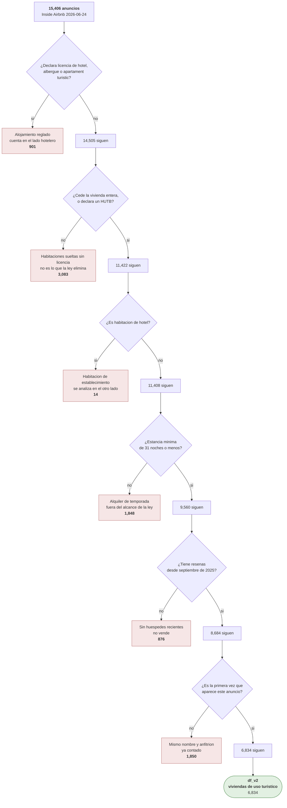

# Criba de los datos

**Generado por `pipeline/generar_criba.py` — no editar a mano.** Los recuentos se leen de los CSV
que el pipeline acaba de producir, asi que no pueden afirmar una criba que ya no ocurre.

Complementa a `docs/linaje.md`: aquel dibuja que fichero alimenta a que script, este dibuja que le
pasa a cada registro.

## Airbnb: que anuncios quedan sujetos a la eliminacion de 2028

Un anuncio puede incumplir varias condiciones a la vez y **solo se cuenta en la primera**. El orden
va de lo estructural a lo circunstancial: primero si la ley le alcanza, despues si sigue vivo, y al
final si hay precio.

| Paso | Descartados | Quedan |
|---|---:|---:|
| Anuncios de partida | — | 15,406 |
| alojamiento reglado | −901 | 14,505 |
| habitacion sin hutb | −3,083 | 11,422 |
| habitacion de hotel | −14 | 11,408 |
| estancia de 32 noches | −1,848 | 9,560 |
| sin actividad desde 09 2025 | −876 | 8,684 |
| duplicado de nombre y anfitrion | −1,850 | 6,834 |
| **Sujetos a la ley de 2028** | | **6,834** |

Los descartados no se borran: quedan en `data/gold/airbnb_excluidos_web.csv` con su `motivo_exclusion`,
de modo que cualquiera puede rehacer el recuento con otro criterio sin volver al dato crudo.
