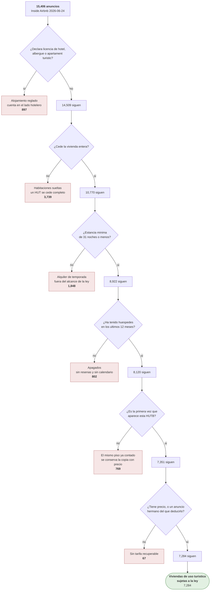

# Criba de los datos

**Generado por `pipeline/generar_criba.py` — no editar a mano.** Los recuentos se leen de los CSV
que el pipeline acaba de producir, asi que no pueden afirmar una criba que ya no ocurre.

Complementa a `docs/linaje.md`: aquel dibuja que fichero alimenta a que script, este dibuja que le
pasa a cada registro.

## Airbnb: que anuncios quedan sujetos a la eliminacion de 2028

Un anuncio puede incumplir varias condiciones a la vez y **solo se cuenta en la primera**. El orden
va de lo estructural a lo circunstancial: primero si la ley le alcanza, despues si sigue vivo, y al
final si hay precio.

| Paso | Descartados | Quedan |
|---|---:|---:|
| Anuncios de partida | — | 15,406 |
| regimen no vut | −897 | 14,509 |
| no es cesion entera | −3,739 | 10,770 |
| estancia de 32 noches | −1,848 | 8,922 |
| sin actividad | −802 | 8,120 |
| repeticion de vivienda | −769 | 7,351 |
| sin precio aprovechable | −67 | 7,284 |
| **Sujetos a la ley de 2028** | | **7,284** |

Los descartados no se borran: quedan en `data/gold/airbnb_excluidos.csv` con su `motivo_exclusion`,
de modo que cualquiera puede rehacer el recuento con otro criterio sin volver al dato crudo.
