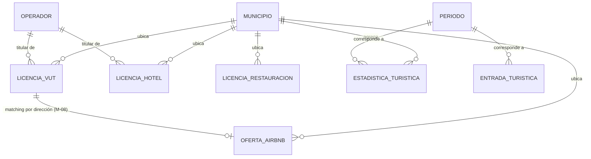

# Modelo de datos

Actualizar este archivo cada vez que se añada, modifique o elimine una tabla o relación. El agente
de codificación debe consultar este archivo antes de tocar el esquema del pipeline.

**Esto es un esquema de partida, no verificado contra las fuentes reales todavía** — la
investigación de fuentes (ver `roadmap.md`) es anterior a la implementación del pipeline, y es
esperable que algunos campos cambien cuando se vea qué publica cada fuente en la práctica. Lo que
no debería cambiar es la forma general: un pequeño esquema en estrella (dimensiones + hechos), que
encaja con DuckDB/Parquet tal como se decidió en `architecture.md`.

**Granularidad — raw vs. exportado:** `data/raw`, `data/bronze` y `data/gold` pueden guardar el detalle que
cada fuente publique (p. ej. dirección si la fuente la da). Lo que se exporta a `data/exports` y
llega al frontend público **nunca baja de nivel municipio/barrio** — nunca dirección o vivienda
individual (ver "Fuera de alcance" en `prd.md`). Esa agregación ocurre en `pipeline/export.py`.

**Precisión geográfica — decisión de alcance (2026-08-28):** no se geocodifica la provincia fuera
de la ciudad de Barcelona. Se descarta el trabajo con la API del Catastro y se acepta trabajar a
dos niveles, declarados en la columna `nivel_geo` que genera `unificar_registros.py`:

| `nivel_geo` | Cobertura | Datos | Sirve para |
|---|---|---|---|
| `coordenada` | Ciudad de Barcelona | lat/lon reales + distrito + barrio | Proximidad y clustering: [M-06], [M-08] |
| `municipio` | Resto de la provincia | municipio + código INE + comarca + código postal (100% completos) | Agregados territoriales: [M-07] |

**Por qué no estorba:** la eliminación de licencias VUT ocurre en la ciudad, que es justo donde sí
hay coordenadas. Fuera de ella lo que interesa es el desplazamiento de oferta entre municipios
([M-07]), que no necesita precisión de portal.

**Regla para quien implemente:** cualquier cálculo de proximidad debe filtrar por
`nivel_geo == "coordenada"`, nunca asumir que todas las filas son comparables entre sí.

---

## Entidades principales

### Dimensiones

#### municipio
Los municipios de la provincia de Barcelona. La geometría para el mapa coroplético es una fuente
más por investigar (ver `architecture.md` → Integraciones externas), no asumida todavía.

| Campo | Tipo | Descripción |
|-------|------|-------------|
| codi_ine | VARCHAR (PK) | Código INE del municipio |
| nombre | VARCHAR | Nombre del municipio |
| comarca | VARCHAR | Comarca a la que pertenece |
| es_ciudad_barcelona | BOOLEAN | `true` solo para el municipio de Barcelona — permite aislar "la ciudad" del resto de la provincia en las comparativas (M-07) |
| regulado_dl3_2023 | BOOLEAN | `true` si el municipio está en los 262 regulados por el Decret Llei 3/2023 de la Generalitat (ver `architecture.md` → Integraciones externas) |
| politica_vut_2028 | VARCHAR | `cero` (Barcelona ciudad y los municipios AMB que se han sumado por decisión propia) \| `tope_generalitat` (resto de los 262 regulados: máx. 10 VUT/100 hab.) \| `sin_regular` (fuera del decreto) |
| geometria_ref | VARCHAR | Referencia al fichero GeoJSON del límite municipal — ya disponible y verificado en `data/raw/geometria/icgc_municipis_provincia_barcelona.geojson` |

`regulado_dl3_2023` y `politica_vut_2028` son dato de referencia, no se derivan del pipeline: salen
del anexo del decreto (lista de 262 municipios) más el seguimiento de qué ayuntamientos han
anunciado ir a cero. Se cargan una vez, se revisan si algún municipio cambia de política — ver
"Datos de referencia" más abajo.

#### periodo
Granularidad mensual donde la fuente lo permita; anual si no.

| Campo | Tipo | Descripción |
|-------|------|-------------|
| fecha | DATE (PK) | Primer día del periodo (mes o año) |
| es_proyectado | BOOLEAN | `false` = dato observado. `true` = tramo de proyección posterior a "hoy" — ver regla de integridad visual en `design-system.md` |

#### operador
Empresa (o persona física) titular de licencias VUT y/o hoteleras.

**Verificado 2026-08-27:** resuelto — el Registre de Turisme de Catalunya sí da `cif` +
`ra_social_del_titular` (o `nom_del_titular`/`primer_cognom`/`segon_cognom` si el titular es una
persona física, no una empresa) para toda la provincia, Barcelona ciudad incluida. `operador_id`
se deriva del CIF cuando existe; para personas físicas, de nombre+apellidos normalizados (la fuente
de Barcelona ciudad, sin este dato, deja de ser necesaria para esta tabla).

| Campo | Tipo | Descripción |
|-------|------|-------------|
| operador_id | VARCHAR (PK) | Derivado del CIF si es empresa; de nombre+apellidos normalizados si es persona física |
| razon_social | VARCHAR NULL | `ra_social_del_titular` — NULL si el titular es persona física |
| nif | VARCHAR NULL | `cif` en la fuente — cubre tanto CIF de empresa como NIF de persona física |
| es_persona_fisica | BOOLEAN | `true` si el titular es una persona física (`nom_del_titular`/apellidos) y no una empresa |
| tipo | VARCHAR | `vut` \| `hotel` \| `ambos` — se deriva de qué licencias tiene asociadas |

### Hechos

#### licencia_vut
**Aviso — no confundir con "Apartaments Turístics" (AT):** son dos figuras legales distintas en el
Registre de Turisme de Catalunya. `licencia_vut` es **solo `tipus_establiment = "Habitatges d'ús
turístic"`** — vivienda residencial normal alquilada entera a turistas (el modelo Airbnb, el que
Barcelona va a eliminar). "Apartaments Turístics" es otra categoría: un edificio construido desde
el origen como apart-hotel, con servicios de hostelería — se regula más como un hotel, nadie lo
está eliminando, y es mucho más pequeño (337 en toda Catalunya frente a 104.561 HUT). Si el
pipeline filtra por tipo de establecimiento, usar el texto exacto de arriba, no "apartament" a
secas — se solaparían las dos categorías por error.

**Verificado 2026-08-27 contra dos fuentes reales**, con perfiles complementarios:
- **Open Data BCN** (ciudad): `N_EXPEDIENT, CODI_DISTRICTE, NOM_DISTRICTE, CODI_BARRI, NOM_BARRI,
  TIPUS_CARRER, CARRER, NUM1..., NUMERO_REGISTRE_GENERALITAT (HUTB-XXXXXX), NUMERO_PLACES,
  LONGITUD_X, LATITUD_Y`. Trae dirección + coordenadas reales (sin ofuscar) — **no trae titular**.
  Serie trimestral hasta 2026 Q1.
- **Registre de Turisme de Catalunya** (toda la provincia, Barcelona ciudad incluida): sí trae
  `cif`/`ra_social_del_titular` (resuelve el hueco de titular), dirección, `total_places`. Usa su
  propio número (`ATB-XXXXXX`), distinto del `HUTB-XXXXXX` de Barcelona ciudad. **Sin lat/lon** y
  **solo estado actual**, no serie histórica.

Estrategia: cruzar ambas por dirección normalizada para Barcelona ciudad (localización de una +
titular de la otra); usar solo el Registre de Turisme para el resto de la provincia.

| Campo | Tipo | Descripción |
|-------|------|-------------|
| licencia_id | VARCHAR (PK) | `N_EXPEDIENT` (Barcelona) o nº `ATB-XXXXXX` (resto de la provincia) |
| numero_hutb | VARCHAR NULL | `HUTB-XXXXXX` — clave de cruce directo con [M-08] (ver `oferta_airbnb.licencia_id_match`). Solo disponible vía Open Data BCN |
| operador_id | VARCHAR FK → operador | Desde el Registre de Turisme de Catalunya (`cif`/`ra_social_del_titular`) |
| codi_ine | VARCHAR FK → municipio | |
| direccion | VARCHAR NULL | Disponible en ambas fuentes — dato administrativo público, no personal |
| lat, lon | DOUBLE NULL | Solo vía Open Data BCN (Barcelona ciudad); para el resto de la provincia, pendiente de geocodificar la dirección |
| plazas | INTEGER NULL | `NUMERO_PLACES` / `total_places` según fuente |
| fecha_alta | DATE | Ninguna fuente la da directamente — se deriva comparando snapshots sucesivos en el tiempo |
| fecha_baja | DATE NULL | Igual que `fecha_alta`: se deriva comparando snapshots, no viene como campo |

#### licencia_hotel
**Incluye hoteles y "Apartaments Turístics" (AT)** — ver aviso en `licencia_vut` sobre por qué son
categorías distintas de HUT. Se modelan juntos aquí porque para [M-06] cumplen la misma función:
son oferta que **no desaparece** con la ley (a diferencia del HUT), así que ambos cuentan como
capacidad de absorción. `tipo` distingue uno de otro cuando haga falta desglosar.

**Estrategia frente a Open Data BCN (decisión 2026-08-28):** Open Data BCN y el Registre de
Turisme **no son duplicados a eliminar** — cada uno tiene datos que el otro no tiene (coordenadas
reales en uno, titular/CIF en el otro). Se resuelve por **record linkage**, no por quedarse con
una sola fuente:
1. Cruzar por **dirección normalizada** (nunca por nombre — verificado que el cruce por nombre
   falla masivamente por diferencias de formato, no porque sean entidades distintas).
2. Si hay match: una sola fila con lo mejor de ambas fuentes (coordenadas de Open Data BCN +
   titular/CIF del Registre de Turisme).
3. Si no hay match: la fila se conserva igual, con los campos que traiga esa fuente — nunca se
   descarta un registro por no tener match en la otra fuente.

**Verificado 2026-08-27:** mismo patrón que `licencia_vut` — Registre de Turisme de Catalunya da
`cif`/`ra_social_del_titular`, dirección, categoría (`3 estrelles`, etc.) y `total_places` para
toda la provincia, con numeración propia por tipo (`HB-XXXXXX` hoteles, `ATB-XXXXXX`... AT — a
confirmar el patrón exacto de AT al implementar), pero solo estado actual, sin lat/lon. Para la
tendencia histórica (nº de hoteles/plazas en el tiempo, no identidad), usar en paralelo **Idescat**
(`docs/architecture.md` → Integraciones externas), que sí da serie por municipio desde 1995 — pero
esa serie es solo de hoteles, no de AT (verificar si Idescat también publica AT por separado).

| Campo | Tipo | Descripción |
|-------|------|-------------|
| licencia_id | VARCHAR (PK) | Nº del Registre de Turisme, formato según tipo |
| tipo | VARCHAR | `hotel` \| `apartament_turistic` |
| operador_id | VARCHAR FK → operador | |
| codi_ine | VARCHAR FK → municipio | |
| direccion | VARCHAR NULL | Dato administrativo público |
| lat, lon | DOUBLE NULL | No la da el Registre de Turisme — pendiente de geocodificar. Necesarias para [M-06]: calcular qué hoteles/AT están "cerca" de un cluster de HUT |
| zona_peuat | VARCHAR NULL | Solo aplica en la ciudad de Barcelona — código real de la capa oficial (`ZE1`, `ZE2`, `ZE3A`, `ZE3B`, `EXCLO`...; 12 zonas en total, ver `architecture.md` y `data/raw/peuat/`). Determina si esa licencia está en una zona donde se permiten licencias nuevas o no; condiciona el "techo" de crecimiento en [M-06], no solo la proximidad |
| categoria | VARCHAR NULL | Estrellas/categoría (aplica sobre todo a hoteles) |
| plazas | INTEGER NULL | Capacidad en personas — `total_places` en el Registre de Turisme |
| habitaciones | INTEGER NULL | Número de habitaciones/unidades — `total_estances` en el Registre de Turisme (verificado: hotel Suizo, 99 `total_places` / 50 `total_estances`, ≈2 personas/habitación, cuadra) |
| fecha_alta | DATE | No viene directa — se deriva de snapshots sucesivos o de la serie de Idescat |
| fecha_baja | DATE NULL | Igual que `fecha_alta` |

**Derivados de precio (implementado 2026-09-02).** Barcelona ciudad, 768 establecimientos. Se
generan en `pipeline/gold/preparar_hoteles_bcn.py` → `data/gold/hoteles_bcn.csv` y se completan en
`modelar_precios_hoteles_bcn.py` → `hoteles_bcn_precio_estimado.csv`.

| Campo | Tipo | Descripción |
|-------|------|-------------|
| estrellas | DOUBLE NULL | 1,0 a 5,0; **4,5 para "4 estrelles superior"**. Nula en hostales, pensiones y AT: no se miden en estrellas y ponerlos en cero afirmaría un orden que no existe |
| tipo_alojamiento | VARCHAR | `hotel_estrellas` (462) \| `sin_estrellas` (293) \| `apartament_turistic` (13) |
| subtipo | VARCHAR | Deducido del nombre comercial, distingue lo que la categoría oficial agrupa entero bajo "No aplica": `hostal` \| `pension` \| `residencia` \| `apartamentos` \| `sin_indicio` |
| cadena, es_cadena | VARCHAR, BOOL | Grupo hotelero. 132 establecimientos en 25 grupos |
| tamano | VARCHAR | Por habitaciones: `muy_pequeno` (≤15) \| `pequeno` (≤40) \| `mediano` (≤100) \| `grande`. Cortes de negocio, no estadísticos |
| origen_coord | VARCHAR | `censo` (446) \| `icgc_verificada` (317) — qué fuente dio la coordenada |
| distancia_centro_km | DOUBLE NULL | Haversine hasta Plaça Catalunya. **No euclídea**: a 41,4° un grado de longitud son 83 km y no 111 |
| precio_noche | DOUBLE NULL | Por habitación y noche, observado. 451 de 768 (58,7%). Ventana del 29-09 al 07-10 de 2026 |
| precio_noche_anual | DOUBLE NULL | `precio_noche` / `factor_temporada`. Es el que se modela y el que sostiene la banda |
| factor_temporada | DOUBLE | Cuánto pesa la ventana raspada sobre la media del año, por categoría (1,10 a 1,18) — de `adr_estacionalidad.csv` |
| origen_precio | VARCHAR NULL | `cruce_inicial` (430) \| `rescate` (21) |
| precio_recortado | BOOL | El valor superaba 5× la mediana de su categoría y se llevó al techo. Dos casos |
| precio_noche_estimado | DOUBLE | Predicción del modelo para **todas** las filas, tengan precio o no |
| precio_es_estimado | BOOL | Si `precio_noche_final` viene del modelo |
| precio_noche_final | DOUBLE | Observado donde lo hay, estimado donde no |
| banda_precio | VARCHAR | `€` <100 \| `€€` 100-175 \| `€€€` 175-300 \| `€€€€` >300, sobre `precio_noche_final` |
| apoyo_estimacion | VARCHAR | `observado` (451) \| `suficiente` (262) \| `justo` (50) \| `escaso` (5). Cuántos ejemplos con precio real sostienen el segmento de esa fila |
| duplicado_probable | BOOL | Mismo nombre y dirección que otra licencia. 8 casos, **no se eliminan**: dos licencias en un portal pueden ser dos negocios |

**Cómo leer `banda_precio`.** El modelo no sabe producir la banda `€`: de 52 establecimientos por
debajo de 100 € acierta 2 y manda los otros 50 a `€€`. Publicar `€` solo cuando
`precio_es_estimado` sea falso; para los estimados cerca del corte, agrupar como "económico". El
acierto de banda exacta es del 65,2% y el de banda exacta o contigua del 98,9%.

**Tabla publicable (`gold/alojamientos_reglados.csv`, revisada 2026-09-15).** Une el censo
provincial con lo que el analisis ha deducido, y es **la unica que debe leer el export**. 1.563
establecimientos, 1.298 con coordenada; la banda economica solo llega a los 763 de la ciudad de
Barcelona, porque el raspado y el modelo cubren la ciudad y extenderlos al resto de la provincia
seria inventar. Los otros 800 salen con `banda_precio` nula, que es la respuesta honesta.

| Campo | Descripcion |
|-------|-------------|
| precision | `exacta` (coordenada del registro) \| `geocodificada` (deducida y verificada contra su municipio). Viaja con el punto porque no valen lo mismo |
| precio_noche_final, banda_precio | Solo ciudad de Barcelona |
| origen_precio | `observado` (451) \| `estimado` (312) \| vacio (800). Sin esta columna un precio imputado seria indistinguible de uno medido en el mapa |

**Una sola columna de procedencia, y es deliberado (2026-09-15).** Antes viajaban aqui
`precio_es_estimado` y `apoyo_estimacion`, y aguas arriba hay ademas `origen_precio` con otros
valores, `metodo_cruce`, `estimacion_fiable`, `modelo_precio` y `mae_modelo_eur`: siete formas de
describir de donde sale un numero. Esa granularidad es correcta para auditar el cruce y el modelo
—se queda intacta en `hoteles_bcn_precio_estimado.csv`— pero publicarla entera obliga a quien lee
el mapa a reconstruir a mano si el precio esta medido o inventado. Aqui sobrevive solo esa
pregunta.

Las 5 estimaciones sin ejemplos comparables (`apoyo_estimacion = escaso`) pierden precio y banda
**en esta tabla**, no en el export. El corte estaba en `export_mapa.py` y dependia de que el export
se acordara; en gold ningun consumidor futuro puede saltarselo.

#### restauracion_bcn

**Tabla real: `data/gold/restauracion_bcn.csv` (9.479 locales), producida por
`pipeline/gold/preparar_restauracion_bcn.py`.** Barcelona ciudad, del censo comercial municipal de
2024. Las comprobaciones que justifican cada decision estan en
`pipeline/notebooks/revisar_restauracion.ipynb`.

| Campo | Tipo | Descripcion |
|-------|------|-------------|
| `local_id` | VARCHAR (PK) | `ID_Global` del censo, **normalizado**: 190 venian entre llaves `{uuid}` y uno con un caracter de mas |
| `nombre` | VARCHAR NULL | Nulo en 56. El censo escribe `SN` --sense nom--; se pasa a nulo de verdad, porque como texto haria que 56 locales se llamaran igual |
| `tipo_local` | VARCHAR | `restaurante` (4.429) \| `bar` (4.272) \| `comida_rapida` (778) |
| `distrito`, `barrio`, `codigo_barrio` | VARCHAR | Oficiales, sin nulos. **Los 73 barrios y los 10 distritos** cubiertos |
| `calle`, `numero`, `direccion` | VARCHAR | `direccion` es la `Direccio_Unica` del censo, que incluye el numero de local |
| `latitud`, `longitud` | DOUBLE | Posicion real, **sin ofuscar**, precision de centimetros. 9.294 puntos distintos: 198 locales comparten punto con otro, y los 11 grupos que lo hacen tienen la misma referencia catastral --son locales del mismo edificio con el punto del portal-- |
| `fecha_revision` | DATE | Cuando se visito ese local |
| `local_identificado` | BOOLEAN | `False` en 197 (2,1%) |

**El alcance son comidas y cenas.** Entran restaurantes, bares y take away. Quedan fuera **por
decision, no por no ser restauracion**, el ocio nocturno (387: se bebe, no se cena) y las
xocolateries/geladeries (148). Y quedan fuera por no serlo: `altres` (6, administraciones de
loteria), `Altres (VENDING)` (4, tiendas 24h), `serveis de menjar i begudes` (74, cajon de sastre
donde 73 no tienen ni nombre) y los 764 de alojamiento, que cuentan con los hoteles.

**`local_identificado = False` no es un duplicado.** `Direccio_Unica` acaba en `LOC NA` cuando el
censo sabe que en ese portal hay un establecimiento pero no cual: son mercados y centros
comerciales --Els Encants 10, Mercat de la Barceloneta 2, Pg Potosi 2 con 48--. Son locales reales
y distintos; borrarlos por repetir direccion y nombre se cargaria 197 que existen.

**Solo se retiraron 2 duplicados reales**, mismo local visitado dos veces: `THREE MARKS COFFEE`
(2021 y 2023) y `DgUSt` (dos veces el mismo dia). Se conserva la visita mas reciente.

**El censo no es una foto de un dia.** El trabajo de campo va de 2023 a 2024: el 43% se visito en
2024 y el 57% en 2023. Es la misma antiguedad desigual que se le reprocha a OSM, con la diferencia
de que aqui viene por local y se puede medir. Los restaurantes se visitaron antes que los bares,
asi que su dato es de media algo mas viejo.

**Cobertura.** Solo Barcelona ciudad: el censo municipal no llega al resto de la provincia, donde
la unica fuente sigue siendo OSM. La capa es hibrida y eso debe explicarse en la web.

#### licencia_restauracion
**Verificado 2026-08-28:** la Diputació de Barcelona (provincia) sí trae NIF y razón social —
corrección sobre el supuesto anterior de que esta categoría no tendría titular identificable.

| Campo | Tipo | Descripción |
|-------|------|-------------|
| licencia_id | VARCHAR (PK) | `id` en la fuente de la Diputació |
| operador_id | VARCHAR FK → operador | Desde `rao_social_nif`/`rao_social_nom` (Diputació). NULL si viene de Open Data BCN ciudad (pendiente verificar si esa sí lo trae) |
| codi_ine | VARCHAR FK → municipio | |
| direccion | VARCHAR NULL | Disponible, con coordenadas |
| lat, lon | DOUBLE NULL | Disponibles vía Diputació (`localitzacio`) |
| tipo | VARCHAR | `bar` \| `restaurante` \| `otro` — se deriva del texto libre `descripcio_activitat` ("BAR",
  "RESTAURANT", "BAR-RESTAURANT"...), no hay un código estable entre municipios |
| fecha_alta | DATE | |
| fecha_baja | DATE NULL | |

#### entrada_turistica
| Campo | Tipo | Descripción |
|-------|------|-------------|
| fecha | DATE FK → periodo | |
| via | VARCHAR | `aeropuerto` \| `puerto` \| `terrestre` |
| origen | VARCHAR NULL | Nacional/internacional o país, si la fuente lo distingue |
| num_entradas | BIGINT | |

La vía `terrestre` solo tiene fuente si se usa Frontur/Idescat como origen (ver
`architecture.md`) — AENA y el Port de Barcelona por separado no cubren entrada por carretera.
Preferir Frontur como fuente única de esta tabla si su desglose por vía es suficiente, en vez de
construirla a mano sumando AENA + Port de Barcelona.

#### estadistica_turistica
| Campo | Tipo | Descripción |
|-------|------|-------------|
| fecha | DATE FK → periodo | |
| codi_ine | VARCHAR FK → municipio | |
| pernoctaciones | BIGINT NULL | |
| grado_ocupacion | DOUBLE NULL | |
| gasto_turistico | DOUBLE NULL | Si la fuente lo publica con detalle usable |

**Aviso realista:** varias estadísticas turísticas oficiales solo se publican a nivel provincial o
por "zona turística", no por municipio individual. Es esperable que `estadistica_turistica` quede
incompleta a nivel municipio para algunas métricas — se documentará caso por caso al integrar cada
fuente, no se va a rellenar con estimaciones silenciosas.

#### oferta_airbnb

**Tabla real: `data/gold/airbnb_para_web.csv` (6.834 anuncios), producida por
`pipeline/notebooks/revisar_airbnb_v2.ipynb`.** El cuaderno es la fuente de verdad: cada paso de
criba, contraste y modelado vive en una celda con su salida, y este diccionario describe lo que
sale de ahi, no un esquema previsto. La contrapartida `airbnb_excluidos_web.csv` guarda los 8.572
descartados con su `motivo_exclusion`, para que ningun anuncio desaparezca sin dejar rastro.

Soporta [M-08] (oferta anunciada frente a licencias oficiales) y [M-06] (banda economica como
variable de sustitucion frente al alojamiento reglado).

**Identificacion y ubicacion**

| Campo | Tipo | Descripcion |
|-------|------|-------------|
| `id` | BIGINT (PK) | Identificador del anuncio en Inside Airbnb |
| `name` | VARCHAR | Titulo del anuncio |
| `host_id`, `host_name` | | Anfitrion segun la fuente |
| `calculated_host_listings_count` | INTEGER | Anuncios del mismo anfitrion: distingue particular de operador |
| `neighbourhood`, `neighbourhood_group` | VARCHAR | Barrio (64) y distrito (10) |
| `latitude`, `longitude` | DOUBLE | **Ya ofuscadas por la fuente hasta 150 m, de forma independiente por anuncio.** Los recuentos por barrio resisten (Spearman 0,998), la asignacion individual de barrio falla un 12% y la distancia entre anuncios es inservible. No se usan para nada que dependa del punto exacto |

**Alojamiento**

| Campo | Tipo | Descripcion |
|-------|------|-------------|
| `room_type`, `property_type` | VARCHAR | Tipo segun la plataforma |
| `accommodates` | INTEGER | Plazas declaradas. **Es el divisor del precio por plaza**: sin nulos, a diferencia de `beds` y `bedrooms` |
| `bedrooms`, `beds` | DOUBLE NULL | Se conservan por trazabilidad; excluidos del modelo por colinealidad con `accommodates` |
| `minimum_nights` | DOUBLE | Maximo 31 tras la criba: 32 o mas queda fuera del ambito de la ley |
| `availability_365`, `number_of_reviews`, `number_of_reviews_ltm`, `last_review`, `review_scores_rating` | | Actividad del anuncio |
| `tipo_cesion` | VARCHAR | `vivienda entera` \| `habitacion`. Un HUTB ampara la cesion del alojamiento completo, asi que anunciar una habitacion bajo un HUTB es una irregularidad propia, no una falta de licencia |

**Licencia: tres estados**

| Campo | Tipo | Descripcion |
|-------|------|-------------|
| `license` | VARCHAR NULL | Campo `license` tal cual, sin parsear, para poder auditar el parseo |
| `licencia_norm`, `prefijo` | VARCHAR NULL | Numero normalizado y su prefijo (`HUTB`, `HB`, `AJ`, `ATB`...) |
| `categoria_licencia` | VARCHAR | Apartamento turistico (HUTB/TU) \| Exencion declarada \| No turistico \| Sin licencia / Nula |
| `consta_en_registro` | BOOLEAN NULL | Si el numero aparece en el registro oficial de la Generalitat |
| `estado_licencia` | VARCHAR | **`con_licencia` (4.985) \| `sin_licencia` (1.351) \| `licencia_sin_acreditar` (498)** |
| `motivo_estado` | VARCHAR | Por que le corresponde ese estado, en texto |

`licencia_sin_acreditar` es que el numero declarado no consta en el registro, o que la licencia
existe pero no ampara lo que se anuncia. **En ningun caso se afirma que la licencia no exista:** lo
que se mide es el incumplimiento de declararla en la plataforma. De los 889 que declaran un numero
por encima del maximo emitido (HUTB-80024), 25 numeros aparecen en anuncios de anfitriones
distintos --hasta quince para el mismo numero--, lo que descarta el error independiente.

**Precio y banda economica**

| Campo | Tipo | Descripcion |
|-------|------|-------------|
| `precio_anuncio` | DOUBLE NULL | Tarifa diaria anunciada del anuncio entero. `price` es la misma columna, duplicada |
| `precio_por_plaza` | DOUBLE NULL | `precio_anuncio / accommodates`, en escala de junio |
| `tramo_estancia` | VARCHAR | Corte en 7 noches: a partir de la septima el precio por plaza cae a la mitad |
| `precio_plaza_recortado` | DOUBLE NULL | Winsorizado a 5x la mediana de su tramo. 8 anuncios recortados |
| `precio_plaza_estimado` | DOUBLE NULL | Estimacion del modelo para los 221 sin precio observado |
| `precio_plaza_es_estimado` | BOOLEAN | Marca de observado frente a estimado. **Obligatoria en la web** (`design-system.md`) |
| `mae_modelo_eur` | DOUBLE | Error del modelo, 13.5 EUR por plaza |
| `factor_temporada` | DOUBLE | 1.188: junio esta un 19% sobre la media anual segun la serie del INE |
| `precio_plaza_final` | DOUBLE | Observado, y estimado donde no lo hay |
| `precio_plaza_anual` | DOUBLE | `precio_plaza_final / factor_temporada`. **Es la columna comparable con el alojamiento reglado** |
| `banda_plaza` | VARCHAR | Banda de `pipeline/gold/bandas.py`, cortes 40/70/120 EUR por plaza |

**La unidad es precio por noche y por plaza disponible, igual en las dos fuentes.** No por ocupante:
una pareja en un piso para cuatro paga el piso, igual que en un hotel paga la habitacion. Es la
unica escala en la que un piso entero y una habitacion doble de hotel se comparan.

Comprobado sobre el volcado: `price` coincide con `price_quote_price_per_night` (ratio 1,00 en
13.355 anuncios) y `price_quote_raw` declara `"currency": "EUR"` en 13.380 cotizaciones. La moneda
deja de ser una suposicion.

**Limitacion que debe acompanar a la banda en la web.** El precio de Airbnb es la tarifa anunciada
y se publica tal cual. Inside Airbnb no captura la limpieza --`cleaning_fee` viene vacio en las
13.662 cotizaciones-- y el dato no permite saber quien la cobra aparte y quien la lleva ya incluida
en la tarifa; estimar un importe comun para todos seria falso para los segundos, asi que no se
corrige. El precio de hotel si incluye todo salvo la tasa turistica. Consecuencia asumida: en las
estancias cortas, que son las que compiten con el hotel, la banda de Airbnb puede quedar por debajo
de lo que se acaba pagando.

**Cobertura.** Inside Airbnb solo publica volcado de la ciudad de Barcelona, no del resto de la
provincia.

**Granularidad publicada.** El pipeline llega al anuncio; `data/exports/mapa/airbnb_por_barrio.json`
sale agregado por barrio (64 filas), nunca en puntos individuales resolubles (ver `prd.md` -> Fuera
de alcance y `design-system.md` -> `ListingClusterMap`).

---

## Relaciones entre entidades

**Nota sobre [M-06] (absorción hotelera por proximidad):** no es una tabla más — es un cálculo
derivado en tiempo de export, no un hecho que se recolecte de ninguna fuente. Toma
`licencia_vut` (agrupadas en clusters por proximidad geográfica) y `licencia_hotel` (con su lat/lon
y plazas) y calcula, por cluster, qué capacidad hotelera hay dentro de un radio definido y qué % de
más necesitaría asumir. El radio, el algoritmo de agrupación y la fórmula exacta se fijan al
implementar la feature (ficha en `docs/features/`), no aquí — este documento solo dice de dónde
salen los datos que ese cálculo necesita.

---

## Políticas de acceso

No aplica en el sentido de RLS: no hay base de datos en producción (ver `architecture.md`), así
que no hay usuarios ni filas restringidas por usuario. Todo lo que llega a `data/exports` es
público por diseño — la única "política" real es la de granularidad de la sección anterior (nunca
exportar a nivel de vivienda individual).

---

## Cambios de esquema

Sustituye a "Migraciones": sin base de datos en producción no hay ficheros de migración SQL, pero
el esquema de `data/bronze` y `data/gold` sí cambia con el tiempo y conviene dejar rastro.

| Fecha | Cambio | Descripción |
|-------|--------|-------------|
| 2026-08-27 | Esquema inicial | Primer borrador: municipio, periodo, operador, licencia_vut, licencia_hotel, licencia_restauracion, entrada_turistica, estadistica_turistica. Sin verificar contra fuentes reales todavía. |
| 2026-09-02 | Derivados de precio en `licencia_hotel` | 21 campos nuevos en `hoteles_bcn.csv` y `hoteles_bcn_precio_estimado.csv`: categoría desdoblada en `estrellas` + `tipo_alojamiento` + `subtipo`, precio observado y estimado, corrección de temporada y banda económica. Retira `categoria_num`, que trataba hostales y AT como escalones de una escala de estrellas. |
| 2026-09-02 | Serie ADR por categoría | `adr_por_categoria.csv` (636 filas, 2013-2026) y `adr_estacionalidad.csv`. Fuente INE vía Portal de Dades del Ajuntament. Ancla el nivel de precio y da el factor de temporada. |
| 2026-09-02 | Arquitectura medallon | `data/processed` se reparte en `data/bronze` (limpio) y `data/gold` (transformado), con `gold/calidad` para los informes. Los cuatro ficheros de precio se reducen a dos: `hoteles_cruce_base` era identico a `hoteles_con_precio` salvo nueve celdas, y `hoteles_bcn_precios_rescatados` era un subconjunto de `precios_emparejamientos`. Nuevo `titular_id`, entero estable por NIF, para agrupar por empresa. |
| 2026-09-02 | Airbnb con capacidad y banda por plaza | `bronze/airbnb_anuncios.csv` une el resumen con el volcado de detalle de Inside Airbnb (90 columnas frente a 19) para incorporar `accommodates`; `gold/airbnb_bcn.csv` anade precio por plaza corregido de temporada y `banda_plaza`. Los alojamientos reglados reciben las mismas dos columnas. `pipeline/gold/bandas.py` guarda la definicion unica de ambas bandas. |
| 2026-09-02 | Airbnb: uso turistico, repeticiones y perfil del anfitrion | `gold/airbnb_bcn.csv` anade `uso_turistico` (<=31 noches, el alcance real del decreto), `borde_31_noches`, `vivienda_id` + `es_repeticion` (una HUTB es una vivienda: 530 licencias aparecen en varios anuncios, 1.028 filas de mas) y `host_perfil` (`solo_con_licencia` / `solo_sin_licencia` / `mixto`). Nada se elimina: se marca. |
| 2026-09-02 | Airbnb se parte en sujetos y excluidos | `gold/airbnb_bcn.csv` guarda ahora solo los 7.327 anuncios sujetos a la ley de 2028 y `gold/airbnb_excluidos.csv` los 8.079 restantes con su `motivo_exclusion`: regimen no VUT (897), no es cesion entera (3.739), 32 noches o mas (1.848), sin actividad (802), repeticion de vivienda (793). Columnas nuevas: `regimen`, `cesion_entera`, `estado_actividad`, `sujeto_a_ley_vut`, `motivo_exclusion`. |
| 2026-09-03 | Una sola cadena de Airbnb | El notebook `revisar_airbnb_v2.ipynb` pasa a leer `bronze/airbnb_anuncios.csv` --que ya trae capacidad-- y a producir `gold/airbnb_para_web.csv` (6.834) y `gold/airbnb_excluidos_web.csv` (8.572), con `estado_licencia` contrastado contra el registro, `tipo_cesion`, `precio_plaza_anual` y `banda_plaza`. `preparar_airbnb_bcn.py` y sus salidas se retiran: aplicaban otra criba y el mapa publicaba desde ellas. |

---

## Datos de referencia

- **municipios de la provincia de Barcelona:** código INE, nombre, comarca — carga única al
  arrancar el pipeline, se actualiza solo si cambia la división administrativa (poco frecuente).
- **geometría municipal (GeoJSON):** para `ChoroplethMap`. Fuente: ICGC (ver `architecture.md`).
- **anexo del Decret Llei 3/2023** (lista de los 262 municipios regulados por la Generalitat) +
  **seguimiento de qué ayuntamientos han anunciado política de "cero VUT en 2028"** (confirmado
  hasta ahora: Barcelona ciudad, L'Hospitalet, Sant Adrià de Besòs, Esplugues, Cornellà, Sant
  Feliu de Llobregat — verificar si hay más al implementar). Alimenta `politica_vut_2028`.

Ninguno se genera desde el pipeline de recolección — son la base sobre la que el pipeline cuelga
el resto de datos, así que se cargan antes que ningún hecho. El tercero es el más inestable de los
tres: a diferencia de la división municipal o la geometría, qué ayuntamientos se suman a la
política de cero puede cambiar mientras dura el proyecto — revisar periódicamente, no darlo por
fijo tras la carga inicial.
