# Linaje de los datos

**Generado por `pipeline/generar_linaje.py` — no editar a mano.** Se reconstruye leyendo el AST de
cada script y anotando que ficheros lee y cuales escribe, asi que describe el pipeline tal como
esta, no como se documento. Volver a ejecutarlo despues de cualquier cambio.

20 scripts, 37 ficheros.

**Llamadas no resueltas:** `bronze/cruzar_precios_hoteles.py` (1), `bronze/unificar_registros.py` (3), `export/export_mapa.py` (3), `export/preparar_geometria_web.py` (2), `gold/auditar_licencias.py` (1), `sources/descargar_fuentes.py` (2), `sources/descargar_ine_barcelona.py` (1), `sources/descargar_serie_vut.py` (2), `sources/geocodificar_registros.py` (1). Son rutas que se componen en tiempo de ejecucion o que llegan como argumento; el grafo no las incluye y por eso se listan aqui en vez de pasar desapercibidas.

```mermaid
flowchart TD
  subgraph raw ["raw · descargas"]
    n_RAIZ_data_raw_airbnb_insideairbnb_barcelona_2026_06_24_listings_csv[("insideairbnb_barcelona_2026-06-24_listings.csv")]
    n_RAIZ_data_raw_airbnb_insideairbnb_barcelona_2026_06_24_listings_detalle_csv_gz[("insideairbnb_barcelona_2026-06-24_listings_detalle.csv.gz")]
    n_RAIZ_data_raw_geometria_icgc_municipis_catalunya_completa_geojson[("icgc_municipis_catalunya_completa.geojson")]
    n_RAIZ_data_raw_geometria_icgc_municipis_provincia_barcelona_geojson[("icgc_municipis_provincia_barcelona.geojson")]
    n_RAIZ_data_raw_geometria_insideairbnb_barrios_barcelona_geojson[("insideairbnb_barrios_barcelona.geojson")]
    n_RAIZ_data_raw_hoteles_hoteles_booking_unificados_2026_csv[("hoteles_booking_unificados_2026.csv")]
    n_RAIZ_data_raw_hoteles_opendata_bcn_hotels_snapshot_csv[("opendata_bcn_hotels_snapshot.csv")]
    n_RAIZ_data_raw_ine_portaldades_adr_por_categoria_2013_2026_csv[("portaldades_adr_por_categoria_2013_2026.csv")]
    n_RAIZ_data_raw_precios_hoteles_google_hotels_2026_09_29_eur_csv[("google_hotels_2026-09-29_eur.csv")]
    n_RAIZ_data_raw_restauracion_hoteles_provincia_provincia_barcelona_restauracion_osm_2026_csv[("provincia_barcelona_restauracion_osm_2026.csv")]
  end
  subgraph bronze ["bronze · limpio"]
    n_RAIZ_data_bronze_adr_estacionalidad_csv[("adr_estacionalidad.csv")]
    n_RAIZ_data_bronze_adr_por_categoria_csv[("adr_por_categoria.csv")]
    n_RAIZ_data_bronze_airbnb_anuncios_csv[("airbnb_anuncios.csv")]
    n_RAIZ_data_bronze_geocodificacion_icgc_csv[("geocodificacion_icgc.csv")]
    n_RAIZ_data_bronze_geocodificacion_verificada_csv[("geocodificacion_verificada.csv")]
    n_RAIZ_data_bronze_hoteles_geocodificados_csv[("hoteles_geocodificados.csv")]
    n_RAIZ_data_bronze_hoteles_y_apartaments_unificados_csv[("hoteles_y_apartaments_unificados.csv")]
    n_RAIZ_data_bronze_municipios_provincia_barcelona_geojson[("municipios_provincia_barcelona.geojson")]
    n_RAIZ_data_bronze_precios_emparejamientos_csv[("precios_emparejamientos.csv")]
    n_RAIZ_data_bronze_precios_hoteles_cruzados_csv[("precios_hoteles_cruzados.csv")]
    n_RAIZ_data_bronze_restauracion_con_municipio_csv[("restauracion_con_municipio.csv")]
    n_RAIZ_data_bronze_serie_ine_barcelona_csv[("serie_ine_barcelona.csv")]
    n_RAIZ_data_bronze_serie_vut_trimestral_csv[("serie_vut_trimestral.csv")]
    n_RAIZ_data_bronze_titulares_csv[("titulares.csv")]
    n_RAIZ_data_bronze_vut_unificados_csv[("vut_unificados.csv")]
  end
  subgraph gold ["gold · transformado"]
    n_RAIZ_data_gold_airbnb_bcn_csv[("airbnb_bcn.csv")]
    n_RAIZ_data_gold_airbnb_excluidos_csv[("airbnb_excluidos.csv")]
    n_RAIZ_data_gold_airbnb_situacion_licencia_csv[("airbnb_situacion_licencia.csv")]
    n_RAIZ_data_gold_alojamientos_reglados_csv[("alojamientos_reglados.csv")]
    n_RAIZ_data_gold_calidad_modelos_precio_comparativa_csv[("modelos_precio_comparativa.csv")]
    n_RAIZ_data_gold_calidad_precio_cobertura_entrenamiento_csv[("precio_cobertura_entrenamiento.csv")]
    n_RAIZ_data_gold_calidad_precio_error_por_segmento_csv[("precio_error_por_segmento.csv")]
    n_RAIZ_data_gold_hoteles_bcn_csv[("hoteles_bcn.csv")]
    n_RAIZ_data_gold_hoteles_bcn_precio_estimado_csv[("hoteles_bcn_precio_estimado.csv")]
  end
  subgraph exports ["exports · web"]
    n_RAIZ_data_exports_mapa_resumen_json[("resumen.json")]
    n_RAIZ_data_exports_mapa_vut_por_barrio_json[("vut_por_barrio.json")]
    n_RAIZ_data_exports_mapa_vut_por_municipio_json[("vut_por_municipio.json")]
  end
  subgraph scripts ["scripts"]
    n_bronze_asignar_municipio_py["bronze/asignar_municipio.py"]
    n_bronze_cruzar_precios_hoteles_py["bronze/cruzar_precios_hoteles.py"]
    n_bronze_enriquecer_hoteles_con_booking_py["bronze/enriquecer_hoteles_con_booking.py"]
    n_bronze_preparar_adr_por_categoria_py["bronze/preparar_adr_por_categoria.py"]
    n_bronze_reparar_geometria_municipios_py["bronze/reparar_geometria_municipios.py"]
    n_bronze_rescatar_precios_hoteles_py["bronze/rescatar_precios_hoteles.py"]
    n_bronze_unificar_airbnb_py["bronze/unificar_airbnb.py"]
    n_bronze_unificar_registros_py["bronze/unificar_registros.py"]
    n_export_export_mapa_py["export/export_mapa.py"]
    n_export_preparar_geometria_web_py["export/preparar_geometria_web.py"]
    n_gold_auditar_licencias_py["gold/auditar_licencias.py"]
    n_gold_modelar_precios_hoteles_bcn_py["gold/modelar_precios_hoteles_bcn.py"]
    n_gold_preparar_airbnb_bcn_py["gold/preparar_airbnb_bcn.py"]
    n_gold_preparar_alojamientos_provincia_py["gold/preparar_alojamientos_provincia.py"]
    n_gold_preparar_hoteles_bcn_py["gold/preparar_hoteles_bcn.py"]
    n_sources_descargar_fuentes_py["sources/descargar_fuentes.py"]
    n_sources_descargar_ine_barcelona_py["sources/descargar_ine_barcelona.py"]
    n_sources_descargar_serie_vut_py["sources/descargar_serie_vut.py"]
    n_sources_geocodificar_hoteles_py["sources/geocodificar_hoteles.py"]
    n_sources_geocodificar_registros_py["sources/geocodificar_registros.py"]
  end
  n_RAIZ_data_bronze_geocodificacion_icgc_csv --> n_bronze_asignar_municipio_py
  n_RAIZ_data_bronze_municipios_provincia_barcelona_geojson --> n_bronze_asignar_municipio_py
  n_RAIZ_data_raw_geometria_insideairbnb_barrios_barcelona_geojson --> n_bronze_asignar_municipio_py
  n_RAIZ_data_raw_restauracion_hoteles_provincia_provincia_barcelona_restauracion_osm_2026_csv --> n_bronze_asignar_municipio_py
  n_bronze_asignar_municipio_py --> n_RAIZ_data_bronze_geocodificacion_verificada_csv
  n_bronze_asignar_municipio_py --> n_RAIZ_data_bronze_restauracion_con_municipio_csv
  n_RAIZ_data_bronze_hoteles_geocodificados_csv --> n_bronze_cruzar_precios_hoteles_py
  n_RAIZ_data_bronze_hoteles_y_apartaments_unificados_csv --> n_bronze_cruzar_precios_hoteles_py
  n_bronze_cruzar_precios_hoteles_py --> n_RAIZ_data_bronze_precios_hoteles_cruzados_csv
  n_RAIZ_data_bronze_precios_hoteles_cruzados_csv --> n_bronze_enriquecer_hoteles_con_booking_py
  n_RAIZ_data_raw_hoteles_hoteles_booking_unificados_2026_csv --> n_bronze_enriquecer_hoteles_con_booking_py
  n_bronze_enriquecer_hoteles_con_booking_py --> n_RAIZ_data_bronze_precios_hoteles_cruzados_csv
  n_RAIZ_data_gold_hoteles_bcn_csv --> n_bronze_preparar_adr_por_categoria_py
  n_RAIZ_data_raw_ine_portaldades_adr_por_categoria_2013_2026_csv --> n_bronze_preparar_adr_por_categoria_py
  n_bronze_preparar_adr_por_categoria_py --> n_RAIZ_data_bronze_adr_estacionalidad_csv
  n_bronze_preparar_adr_por_categoria_py --> n_RAIZ_data_bronze_adr_por_categoria_csv
  n_RAIZ_data_raw_geometria_icgc_municipis_provincia_barcelona_geojson --> n_bronze_reparar_geometria_municipios_py
  n_bronze_reparar_geometria_municipios_py --> n_RAIZ_data_bronze_municipios_provincia_barcelona_geojson
  n_RAIZ_data_bronze_precios_emparejamientos_csv --> n_bronze_rescatar_precios_hoteles_py
  n_RAIZ_data_bronze_precios_hoteles_cruzados_csv --> n_bronze_rescatar_precios_hoteles_py
  n_RAIZ_data_gold_hoteles_bcn_csv --> n_bronze_rescatar_precios_hoteles_py
  n_RAIZ_data_raw_precios_hoteles_google_hotels_2026_09_29_eur_csv --> n_bronze_rescatar_precios_hoteles_py
  n_bronze_rescatar_precios_hoteles_py --> n_RAIZ_data_bronze_precios_emparejamientos_csv
  n_RAIZ_data_raw_airbnb_insideairbnb_barcelona_2026_06_24_listings_csv --> n_bronze_unificar_airbnb_py
  n_RAIZ_data_raw_airbnb_insideairbnb_barcelona_2026_06_24_listings_detalle_csv_gz --> n_bronze_unificar_airbnb_py
  n_bronze_unificar_airbnb_py --> n_RAIZ_data_bronze_airbnb_anuncios_csv
  n_RAIZ_data_bronze_titulares_csv --> n_bronze_unificar_registros_py
  n_bronze_unificar_registros_py --> n_RAIZ_data_bronze_titulares_csv
  n_RAIZ_data_bronze_geocodificacion_icgc_csv --> n_export_export_mapa_py
  n_RAIZ_data_bronze_restauracion_con_municipio_csv --> n_export_export_mapa_py
  n_RAIZ_data_bronze_vut_unificados_csv --> n_export_export_mapa_py
  n_RAIZ_data_gold_airbnb_bcn_csv --> n_export_export_mapa_py
  n_RAIZ_data_gold_airbnb_excluidos_csv --> n_export_export_mapa_py
  n_RAIZ_data_gold_alojamientos_reglados_csv --> n_export_export_mapa_py
  n_export_export_mapa_py --> n_RAIZ_data_exports_mapa_resumen_json
  n_export_export_mapa_py --> n_RAIZ_data_exports_mapa_vut_por_barrio_json
  n_export_export_mapa_py --> n_RAIZ_data_exports_mapa_vut_por_municipio_json
  n_RAIZ_data_bronze_vut_unificados_csv --> n_gold_auditar_licencias_py
  n_gold_auditar_licencias_py --> n_RAIZ_data_gold_airbnb_situacion_licencia_csv
  n_RAIZ_data_gold_hoteles_bcn_csv --> n_gold_modelar_precios_hoteles_bcn_py
  n_gold_modelar_precios_hoteles_bcn_py --> n_RAIZ_data_gold_calidad_modelos_precio_comparativa_csv
  n_gold_modelar_precios_hoteles_bcn_py --> n_RAIZ_data_gold_calidad_precio_cobertura_entrenamiento_csv
  n_gold_modelar_precios_hoteles_bcn_py --> n_RAIZ_data_gold_calidad_precio_error_por_segmento_csv
  n_gold_modelar_precios_hoteles_bcn_py --> n_RAIZ_data_gold_hoteles_bcn_precio_estimado_csv
  n_RAIZ_data_bronze_adr_estacionalidad_csv --> n_gold_preparar_airbnb_bcn_py
  n_RAIZ_data_bronze_airbnb_anuncios_csv --> n_gold_preparar_airbnb_bcn_py
  n_RAIZ_data_gold_airbnb_situacion_licencia_csv --> n_gold_preparar_airbnb_bcn_py
  n_gold_preparar_airbnb_bcn_py --> n_RAIZ_data_gold_airbnb_bcn_csv
  n_gold_preparar_airbnb_bcn_py --> n_RAIZ_data_gold_airbnb_excluidos_csv
  n_RAIZ_data_bronze_geocodificacion_verificada_csv --> n_gold_preparar_alojamientos_provincia_py
  n_RAIZ_data_bronze_hoteles_y_apartaments_unificados_csv --> n_gold_preparar_alojamientos_provincia_py
  n_RAIZ_data_gold_hoteles_bcn_precio_estimado_csv --> n_gold_preparar_alojamientos_provincia_py
  n_gold_preparar_alojamientos_provincia_py --> n_RAIZ_data_gold_alojamientos_reglados_csv
  n_RAIZ_data_bronze_adr_estacionalidad_csv --> n_gold_preparar_hoteles_bcn_py
  n_RAIZ_data_bronze_geocodificacion_verificada_csv --> n_gold_preparar_hoteles_bcn_py
  n_RAIZ_data_bronze_hoteles_geocodificados_csv --> n_gold_preparar_hoteles_bcn_py
  n_RAIZ_data_bronze_hoteles_y_apartaments_unificados_csv --> n_gold_preparar_hoteles_bcn_py
  n_RAIZ_data_bronze_precios_emparejamientos_csv --> n_gold_preparar_hoteles_bcn_py
  n_RAIZ_data_bronze_precios_hoteles_cruzados_csv --> n_gold_preparar_hoteles_bcn_py
  n_RAIZ_data_raw_geometria_insideairbnb_barrios_barcelona_geojson --> n_gold_preparar_hoteles_bcn_py
  n_RAIZ_data_raw_hoteles_opendata_bcn_hotels_snapshot_csv --> n_gold_preparar_hoteles_bcn_py
  n_gold_preparar_hoteles_bcn_py --> n_RAIZ_data_gold_hoteles_bcn_csv
  n_RAIZ_data_raw_geometria_icgc_municipis_catalunya_completa_geojson --> n_sources_descargar_fuentes_py
  n_sources_descargar_fuentes_py --> n_RAIZ_data_raw_geometria_icgc_municipis_provincia_barcelona_geojson
  n_sources_descargar_ine_barcelona_py --> n_RAIZ_data_bronze_serie_ine_barcelona_csv
  n_sources_descargar_serie_vut_py --> n_RAIZ_data_bronze_serie_vut_trimestral_csv
  n_RAIZ_data_bronze_hoteles_y_apartaments_unificados_csv --> n_sources_geocodificar_hoteles_py
  n_sources_geocodificar_hoteles_py --> n_RAIZ_data_bronze_hoteles_geocodificados_csv
  n_RAIZ_data_bronze_geocodificacion_icgc_csv --> n_sources_geocodificar_registros_py
  n_sources_geocodificar_registros_py --> n_RAIZ_data_bronze_geocodificacion_icgc_csv
```

## Dependencias por script

| Script | Capa | Lee | Escribe |
|---|---|---|---|
| `bronze/asignar_municipio.py` | bronze | geocodificacion_icgc.csv municipios_provincia_barcelona.geojson insideairbnb_barrios_barcelona.geojson provincia_barcelona_restauracion_osm_2026.csv | geocodificacion_verificada.csv restauracion_con_municipio.csv |
| `bronze/cruzar_precios_hoteles.py` | bronze | hoteles_geocodificados.csv hoteles_y_apartaments_unificados.csv | precios_hoteles_cruzados.csv |
| `bronze/enriquecer_hoteles_con_booking.py` | bronze | precios_hoteles_cruzados.csv hoteles_booking_unificados_2026.csv | precios_hoteles_cruzados.csv |
| `bronze/preparar_adr_por_categoria.py` | bronze | hoteles_bcn.csv portaldades_adr_por_categoria_2013_2026.csv | adr_estacionalidad.csv adr_por_categoria.csv |
| `bronze/reparar_geometria_municipios.py` | bronze | icgc_municipis_provincia_barcelona.geojson | municipios_provincia_barcelona.geojson |
| `bronze/rescatar_precios_hoteles.py` | bronze | precios_emparejamientos.csv precios_hoteles_cruzados.csv hoteles_bcn.csv google_hotels_2026-09-29_eur.csv | precios_emparejamientos.csv |
| `bronze/unificar_airbnb.py` | bronze | insideairbnb_barcelona_2026-06-24_listings.csv insideairbnb_barcelona_2026-06-24_listings_detalle.csv.gz | airbnb_anuncios.csv |
| `bronze/unificar_registros.py` | bronze | titulares.csv | titulares.csv |
| `export/export_mapa.py` | export | geocodificacion_icgc.csv restauracion_con_municipio.csv vut_unificados.csv airbnb_bcn.csv airbnb_excluidos.csv alojamientos_reglados.csv | resumen.json vut_por_barrio.json vut_por_municipio.json |
| `export/preparar_geometria_web.py` | export | — | — |
| `gold/auditar_licencias.py` | gold | vut_unificados.csv | airbnb_situacion_licencia.csv |
| `gold/modelar_precios_hoteles_bcn.py` | gold | hoteles_bcn.csv | modelos_precio_comparativa.csv precio_cobertura_entrenamiento.csv precio_error_por_segmento.csv hoteles_bcn_precio_estimado.csv |
| `gold/preparar_airbnb_bcn.py` | gold | adr_estacionalidad.csv airbnb_anuncios.csv airbnb_situacion_licencia.csv | airbnb_bcn.csv airbnb_excluidos.csv |
| `gold/preparar_alojamientos_provincia.py` | gold | geocodificacion_verificada.csv hoteles_y_apartaments_unificados.csv hoteles_bcn_precio_estimado.csv | alojamientos_reglados.csv |
| `gold/preparar_hoteles_bcn.py` | gold | adr_estacionalidad.csv geocodificacion_verificada.csv hoteles_geocodificados.csv hoteles_y_apartaments_unificados.csv precios_emparejamientos.csv precios_hoteles_cruzados.csv insideairbnb_barrios_barcelona.geojson opendata_bcn_hotels_snapshot.csv | hoteles_bcn.csv |
| `sources/descargar_fuentes.py` | sources | icgc_municipis_catalunya_completa.geojson | icgc_municipis_provincia_barcelona.geojson |
| `sources/descargar_ine_barcelona.py` | sources | — | serie_ine_barcelona.csv |
| `sources/descargar_serie_vut.py` | sources | — | serie_vut_trimestral.csv |
| `sources/geocodificar_hoteles.py` | sources | hoteles_y_apartaments_unificados.csv | hoteles_geocodificados.csv |
| `sources/geocodificar_registros.py` | sources | geocodificacion_icgc.csv | geocodificacion_icgc.csv |
