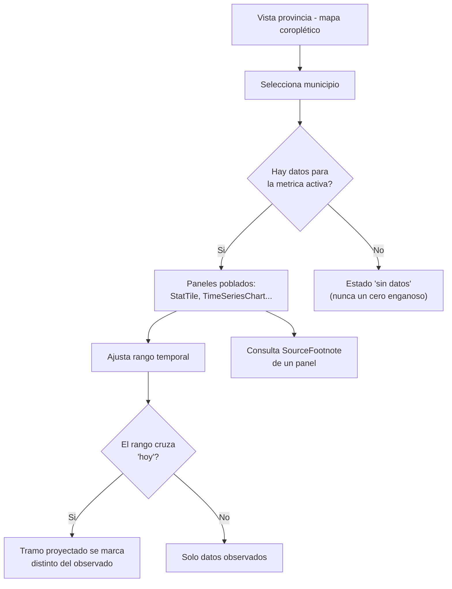
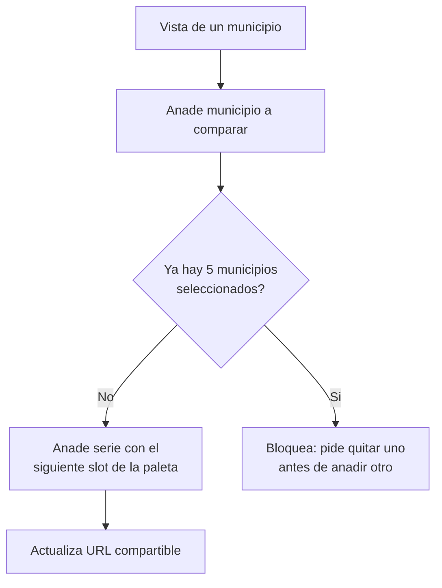
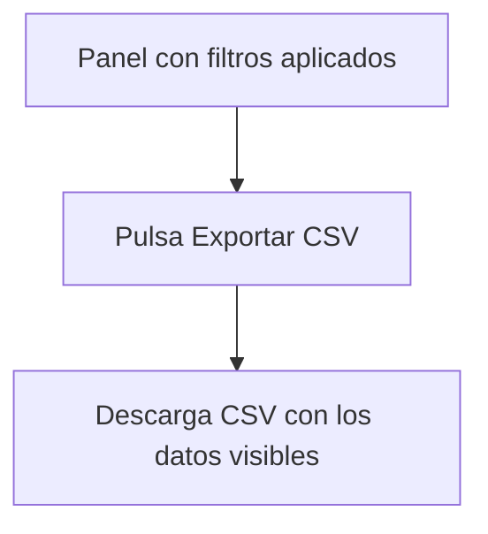

# Flujos de usuario

Documentación detallada de los flujos de usuario principales. El PRD los describe
narrativamente (ver `prd.md` → "Flujos de usuario principales"); este archivo entra en detalle con
diagramas y estados. Actualizar cuando cambie un flujo existente o se añada uno nuevo.

---

## Convenciones de este documento

Los flujos se documentan con descripción narrativa, diagrama de estados en Mermaid, y casos de
error. Cada flujo tiene un ID para poder referenciarlo desde `prd.md` o desde el código.

**No hay sesión de usuario** (sin cuentas, ver `prd.md`): todo "estado" de estos flujos es estado
de interfaz — filtros, selección de municipio(s), rango temporal — no estado de servidor. Ese
estado se refleja en la URL (query string) para que cualquier vista filtrada sea compartible y
citable, coherente con el público objetivo (prensa, investigadores) de `prd.md`.

---

## [FLOW-01] — Exploración principal

**Actor:** cualquier visitante, sin cuenta.
**Trigger:** entra en la página principal del dashboard.
**Resultado esperado:** ha visto la evolución de oferta turística (VUT/hotel/restauración) y
llegadas de turistas para el municipio y periodo que le interesan, con las fuentes visibles.

### Pasos

1. Llega a la página principal — ve el mapa coroplético de la provincia con la métrica por defecto
   (licencias VUT activas) y el rango temporal por defecto.
2. Selecciona un municipio en el mapa o en el `FilterBar`.
3. Los paneles (`StatTile`, `TimeSeriesChart`...) se actualizan para ese municipio; la selección
   se refleja en la URL.
4. Ajusta el rango temporal (2021–2031). Si el rango incluye el tramo posterior a "hoy",
   `TimeSeriesChart` distingue visualmente observado vs. proyectado (regla de integridad de
   `design-system.md`).
5. Consulta el `SourceFootnote` de cualquier panel para verificar de dónde sale el dato.

### Diagrama

### Casos de error

- **Municipio sin datos para la métrica activa:** estado "sin datos" explícito (ver [M-01] en
  `prd.md`), nunca un cero que se confunda con "cero licencias".
- **Fuente caída o export vacío en el build:** el panel afectado se oculta con una nota explicando
  qué falta — nunca se muestra con datos vacíos o rotos en silencio.
- **Rango temporal:** los controles no permiten seleccionar fuera de 2021–2031, el slider está
  acotado al alcance del proyecto.

---

## [FLOW-02] — Comparación territorial

**Actor:** cualquier visitante.
**Trigger:** desde la vista de un municipio, añade otros municipios a comparar.
**Resultado esperado:** ve varios municipios — incluida "ciudad de Barcelona" como referencia —
lado a lado, para detectar si la oferta turística se desplaza fuera de la ciudad ([M-07]).

### Pasos

1. Desde `FilterBar`, añade uno o más municipios adicionales a la selección.
2. `ComparisonBarChart` y `TimeSeriesChart` pasan a modo multi-serie, una serie por municipio, con
   leyenda y orden de color fijo (paleta categórica de `design-system.md`).
3. Al llegar a 5 municipios seleccionados, el dashboard impide añadir más sin quitar uno antes —
   no crece la paleta ni la leyenda indefinidamente.
4. La URL refleja los municipios seleccionados.

### Diagrama

### Casos de error

- **Municipios sin ninguna métrica en común con datos:** mensaje explicando qué falta, nunca un
  gráfico vacío sin explicación.

---

## [FLOW-03] — Exportar datos filtrados

**Actor:** cualquier visitante ([S-02] en `prd.md`).
**Trigger:** pulsa "Exportar CSV" en un panel con filtros aplicados.
**Resultado esperado:** descarga un CSV con exactamente los datos visibles en pantalla tras los
filtros — no el dataset completo sin filtrar.

### Pasos

1. Aplica filtros (municipio(s), rango temporal) en cualquier panel.
2. Pulsa `ExportButton`.
3. Descarga un CSV cuyas filas y columnas coinciden con lo visible en el panel.

### Diagrama

### Casos de error

- **Ningún dato visible tras los filtros:** `ExportButton` se deshabilita — nunca genera un CSV
  vacío sin explicación.
